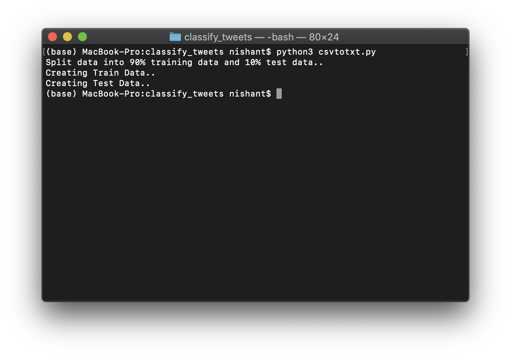
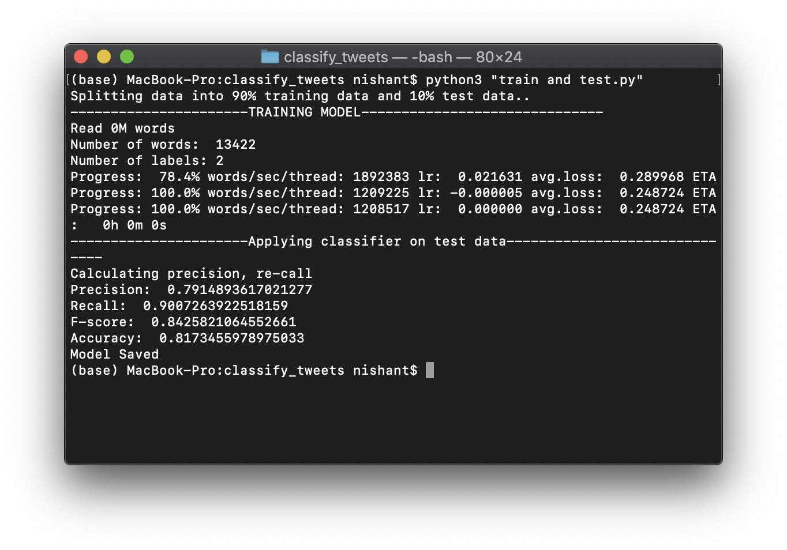
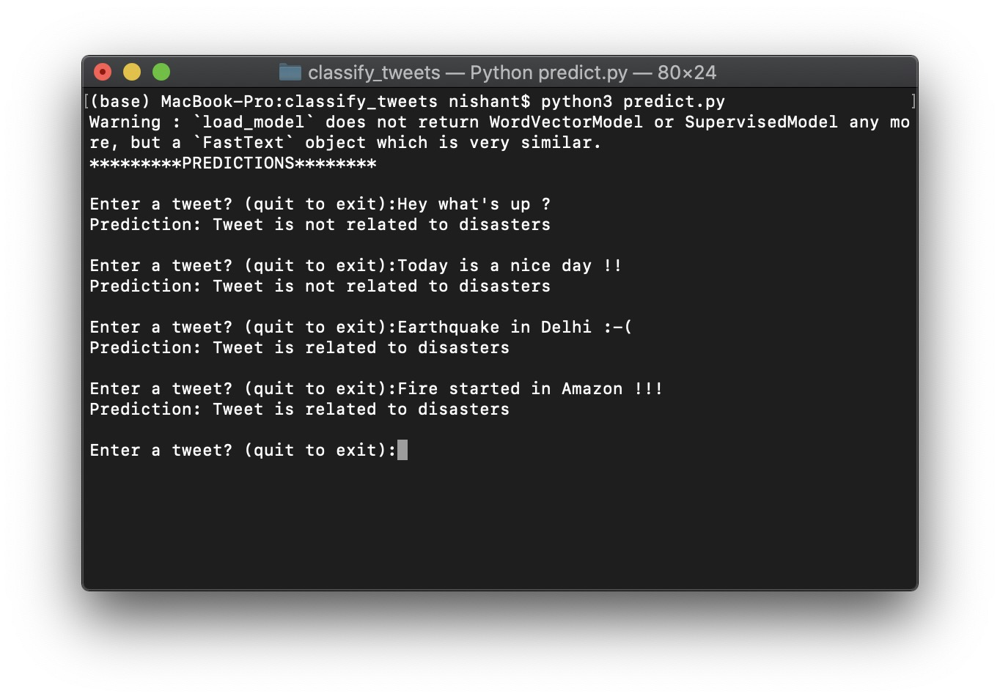

# Disaster Related Tweets
### This project is a ML project for classifying tweets whether they are related to disaster or not. 
## How to use ?
- ### Clone project
- ### Install Requirements
- ### Run csvtotxt.py in case of changed dataset
- ### Run "train and test.py" file to create and save a model
- ### Run predict.py to start interaction with tool
---
### Dividing Data into ratio of 9:1

### Training and testing

### Interaction

